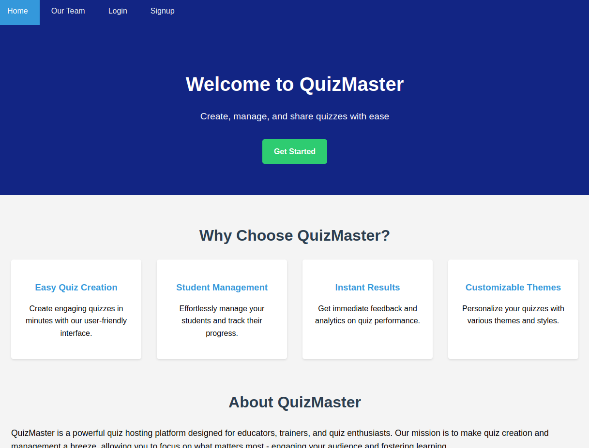
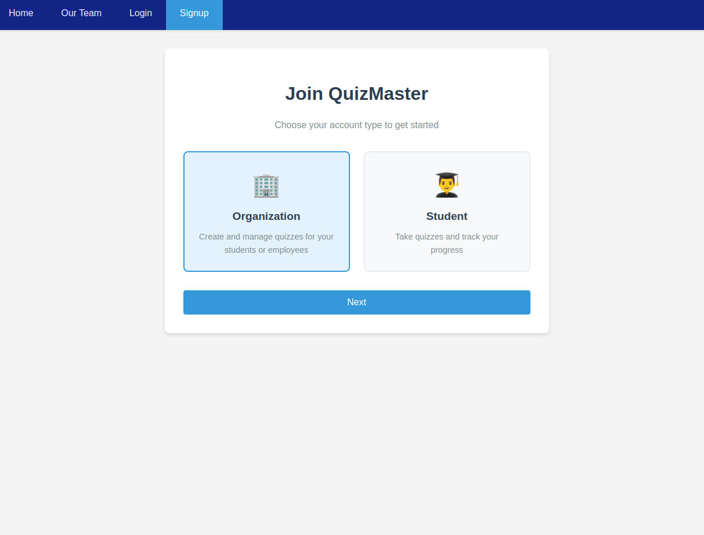
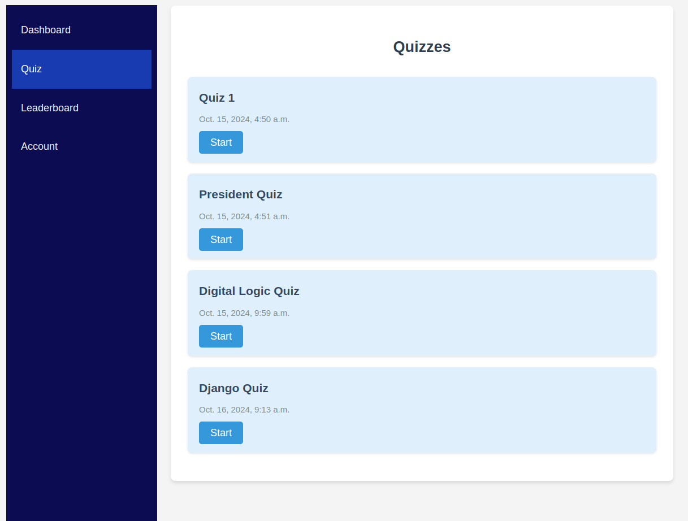
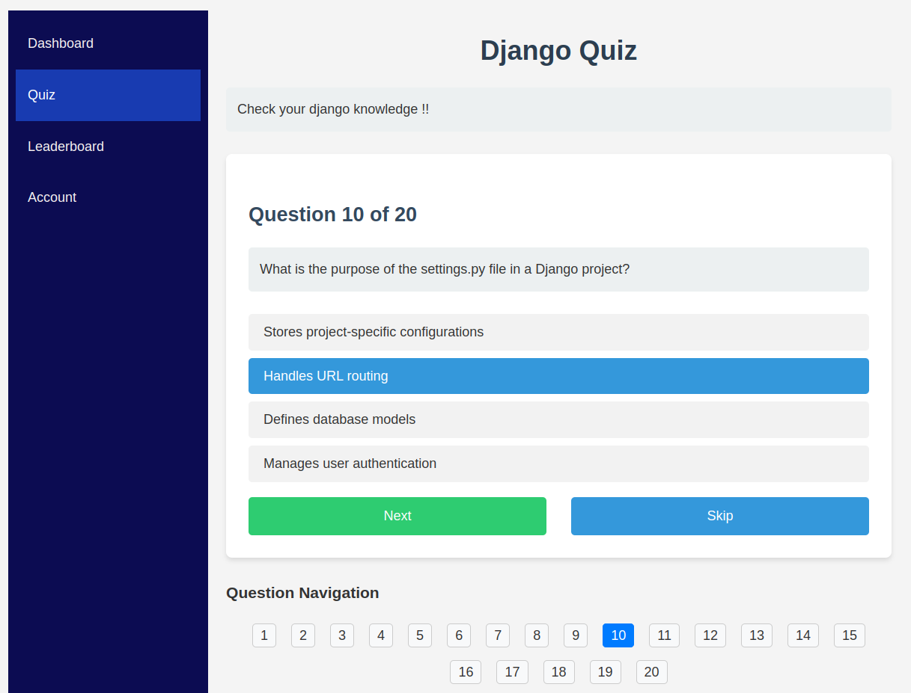
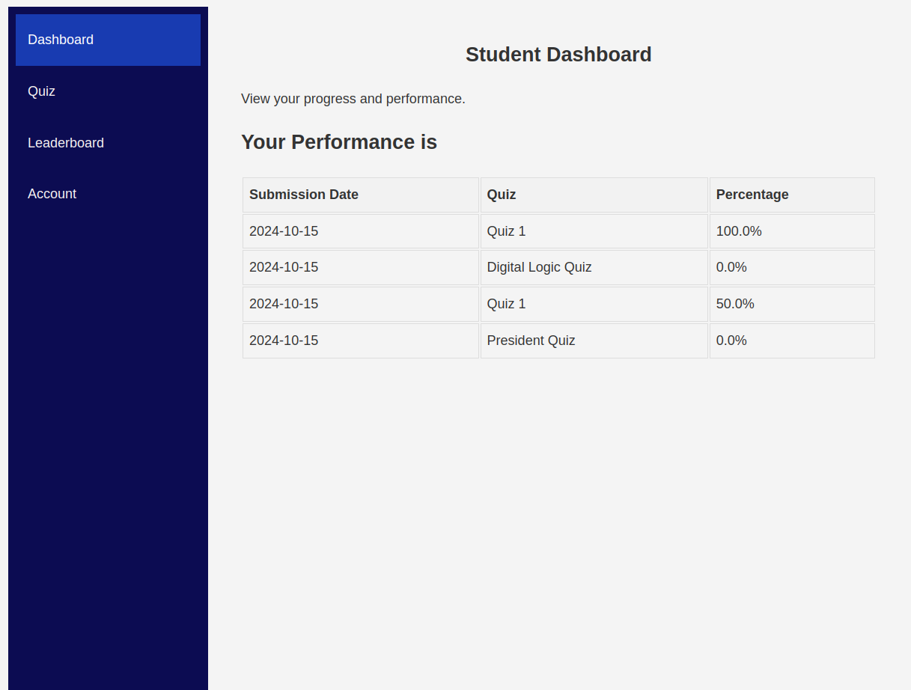
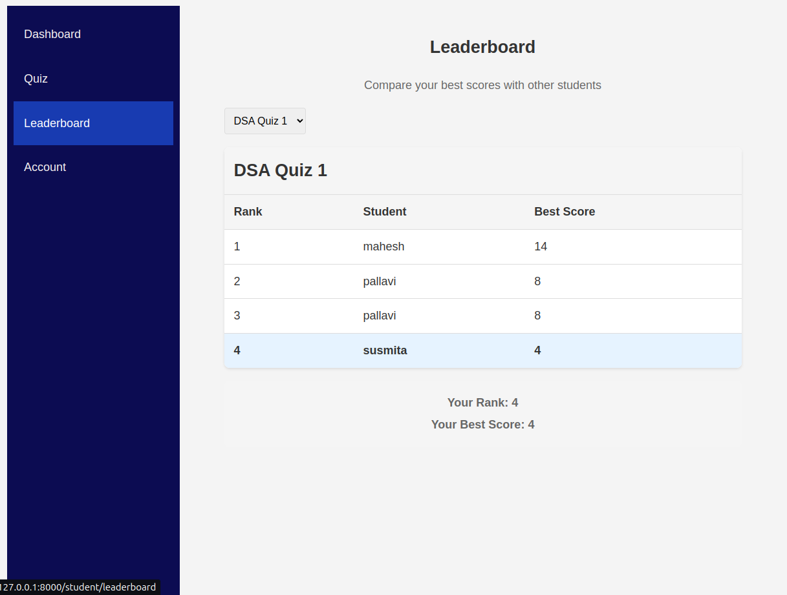
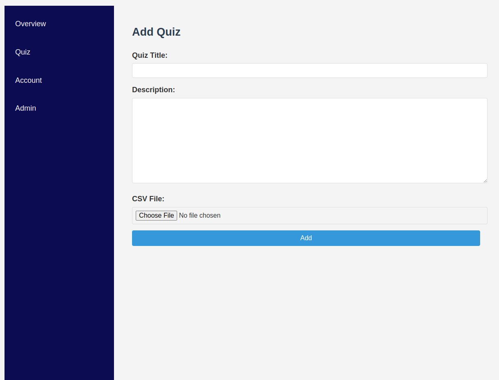

# Quiz Master

A Django-based web application for creating and taking quizzes.

## Features

- Create and manage quizzes
- Take quizzes with multiple-choice questions
- Navigate between questions easily
- View quiz results

## Installation

1. Clone the repository:
   ```
   https://github.com/rohitjoshi21/QuizMaster
   cd QuizMaster
   ```

2. Create a virtual environment and activate it:
   ```
   python -m venv venv
   source venv/bin/activate  # On Windows, use `venv\Scripts\activate`
   ```

3. Install the required packages:
   ```
   pip install -r requirements.txt
   ```

4. Run migrations:
   ```
   python manage.py migrate
   ```

5. Create a superuser:
   ```
   python manage.py createsuperuser
   ```

6. Run the development server:
   ```
   python manage.py runserver
   ```

## Usage

1. Login using organization account to add and update quizzes.
2. Navigate to `http://localhost:8000/` to view and take quizzes.

## Screenshots

Here are some screenshots of the Quiz Master application:

1. Home Page

   

2. Signing Up

   

3. Quizzes

   

4. Quiz Ongoing

   

5. User Dashboard

   

6. Leaderboard

   

7. Adding Quiz

   

## To Do

1. Save the quiz result for each user in database. DONE
2. Add data and visualization in dashboard. DONE
3. Write script to load questions from csv into database. DONE
4. Add css to login and signup pages. DONE
5. Implement leaderboard DONE
6. Create organization page for student monitoring and analysis. Partially Done